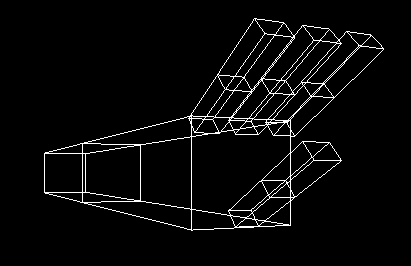
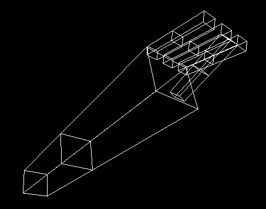
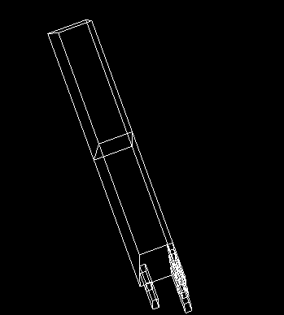
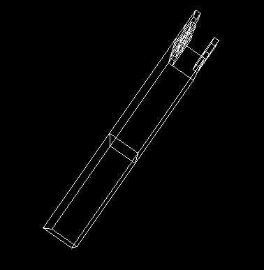
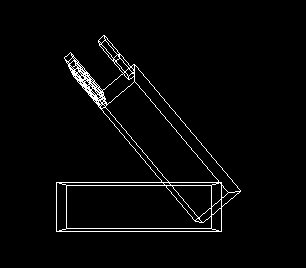
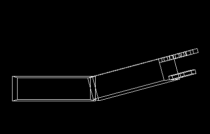
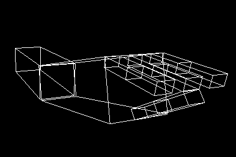
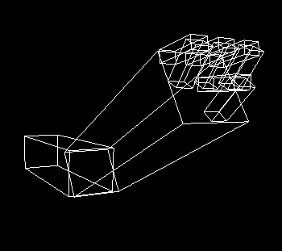

## This program shows how to composite modeling transformations to draw translated and rotated hierarchical models Using OpenGL.

### **1-Apply transformations to animate the model:**
   * Fixed point rotation is applied on the whole arm.
   * I faced a little problem in the rotation of fingers, first i was rotating all of them in the same direction but it showed up that i should rotate the other fingers in opposite direction of the thumb. So, i handled it by changing the sign of the rotating angle to inverse the rotating matrix. 

Before | After
  -----|------
   | 

#

### **2-Interaction with keyboard:**

* pressing the 's' and 'S' keys alters the rotation of the shoulder in and out respectively. Its limitations from -90 to 90 degress.
Shoulder In | Shoulder Out
  ----------|-----------
   | 

* pressing the 'e' and 'E' keys alters the rotation of the elbow in and out respectively. Its limitations from 0 to 130 degress.
Elbow In | Elbow Out
  -------|---------
   | 

* pressing the 'f' and 'F' keys alters the rotation of the fingers bases in and out respectively. Its limitations from 0 to 90 degress.
  
* pressing the 'g' and 'G' keys alters the rotation of the fingers ups in and out respectively. Its limitations from 0 to 130 degress.

Fingers Bases In | Fingers Ups In
  ---------------|---------------
   | 


## Requirements

```
sudo apt-get install freeglut3-dev
```

### then run project on windows or compile in linux By:

```
gcc -o arm arm.c -lGL -lGLU -lglut -lm
./arm
```